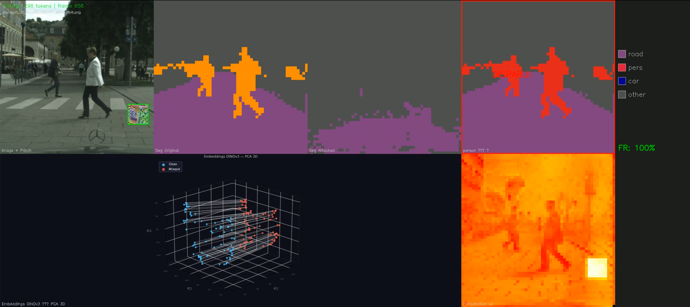
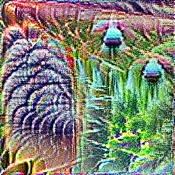

# Adversarial Patch Attacks on DINOv3


> [!CAUTION]
> **This project was created in a strictly academic context.**
> Its purpose is to **raise awareness of the risks** posed by adversarial patch attacks on perception systems in autonomous vehicles — not to provide a tool for malicious use. All experiments are conducted on public data (Cityscapes) in a simulated environment.

Adversarial patch attacks on a semantic classifier built on top of DINOv3 (ViT-S/16). The patch causes pedestrians (or any other class) to disappear or be misclassified in a driving sequence.

<div align="center">

| **Attack visualization**<br><em>Person no longer detected (Seg Attacked empty)</em> | **Adversarial patch** |
|:---:|:---:|
|  |  |

</div>

---

## Pipeline

```
1. train_classifier.py   → train a linear probe on DINOv3 tokens (Cityscapes)
2. generate_patch.py     → optimize an adversarial patch against the classifier
3. visualize_sequence.py → visualize the attack on a sequence + export video
4. eval_transfer.py      → evaluate transferability to a YOLO detector
```

---

## Quick Start

```bash
# Install the project
uv sync

# Place DINOv3 weights at:
# src/patch_attack/models/weights/dinov3_vits16_pretrain_lvd1689m-08c60483.pth

# 1. Train the classifier
train-classifier

# 2. Generate the adversarial patch
generate-patch

# 3. Visualize on a sequence
visualize-sequence

# 4. Evaluate transferability to YOLO
eval-transfer
```

All parameters are in [`src/patch_attack/utils/config.py`](src/patch_attack/utils/config.py) — **no CLI arguments**.

**Development:**
```bash
uv sync --all-extras
inv check      # format + lint + typecheck + test
inv typecheck  # mypy only
inv lint       # ruff only
```

---

## Structure

```
.
├── data/
│   ├── stuttgart/                  # Driving sequences
│   │   ├── stuttgart_00/
│   │   ├── stuttgart_01/
│   │   └── stuttgart_02/           # Default sequence (VIZ_DATASET)
│   ├── leftImg8bit_trainvaltest/   # Cityscapes images
│   └── gtFine_trainvaltest/        # Cityscapes labels
├── results/
│   ├── classifier.pt               # Trained classifier
│   ├── targeted_patch_best.pt      # Best patch (max fooling rate during training)
│   ├── targeted_patch_final.pt     # Final patch (used by default)
│   ├── targeted_attack_results.png # Fooling rate curve + patch
│   ├── patch_evolution/            # Patch snapshots (log-spaced)
│   ├── patch_evolution.mp4         # Patch evolution video
│   ├── patch_evolution_grid.png    # Snapshot grid
│   ├── transfer_stuttgart_02.png   # Transferability graph
│   └── demo/
│       ├── stuttgart_02.mp4        # Attack video on sequence
│       └── stuttgart_02_analysis.png  # Fooling rate graph across 3 distances
└── src/
    └── patch_attack/
        ├── train_classifier.py
        ├── generate_patch.py
        ├── visualize_sequence.py
        ├── eval_transfer.py
        ├── utils/
        │   ├── config.py           # All parameters
        │   └── viz.py              # Visualization utilities
        └── models/
            ├── dinov3/             # DINOv3 code
            ├── dinov3_loader.py
            └── weights/            # Weights (not tracked by git)
```

---

## Configuration

Everything is in [`src/patch_attack/utils/config.py`](src/patch_attack/utils/config.py):

```python
CITYSCAPES_IMAGES = "data/leftImg8bit_trainvaltest/leftImg8bit/train"
CITYSCAPES_LABELS = "data/gtFine_trainvaltest/gtFine/train"
DATASET           = "data/leftImg8bit_trainvaltest/leftImg8bit/train"
VIZ_DATASET       = "data/stuttgart/stuttgart_02"  # or stuttgart_00, stuttgart_01
CLASSIFIER        = "results/classifier.pt"
PATCH             = "results/targeted_patch_final.pt"
OUTPUT_DIR        = "results"

IMG_SIZE = 896      # 224=14×14 | 448=28×28 | 672=42×42 | 896=56×56 tokens

CLF_EPOCHS = 200
CLF_LR     = 0.001

SOURCE_CLASS             = 11    # person (0=road, 13=car, …)
TARGET_CLASS             = -1    # -1 = untargeted, otherwise target class ID
ATTACK_STEPS             = 4000
ATTACK_LR                = 0.05
ATTACK_BATCH_SIZE        = 4
ATTACK_MIN_SOURCE_TOKENS = 10    # images filtered if < N source tokens
PATCH_SIZE               = 143   # size on the image (~16% of IMG_SIZE)
PATCH_RES                = 384   # internal optimization resolution
PATCH_PERSPECTIVE_MIN_SCALE = 0.3  # 3× smaller at top (far) than bottom (near)

YOLO_MODEL       = "yolov8n.pt"
YOLO_CONF        = 0.25
YOLO_PERSON_CLASS = 0
```

> [!TIP]
> If VRAM is limited, reduce `IMG_SIZE` first (quadratic impact on attention), then `ATTACK_BATCH_SIZE`.

---

## Step 1 — Linear Classifier

Trains `nn.Linear(384, 19)` on DINOv3 token embeddings with Cityscapes labels.

**Required data** ([cityscapes-dataset.com](https://www.cityscapes-dataset.com/downloads/)):
- `leftImg8bit_trainvaltest.zip` → `data/leftImg8bit_trainvaltest/leftImg8bit/train/`
- `gtFine_trainvaltest.zip` → `data/gtFine_trainvaltest/gtFine/train/`

A live window shows GT vs predictions on 4 representative images at each epoch.

**Output:** `results/classifier.pt`

---

## Step 2 — Adversarial Patch

Optimizes a patch so that tokens of the source class are misclassified.

**Perspective scaling**: patch size varies with vertical position — smaller at the top (far), larger at the bottom (near). `compute_perspective_size(x)` ensures consistent scaling with a driving camera.

**Filtering**: only images with ≥ `ATTACK_MIN_SOURCE_TOKENS` source class tokens are used, both at load time and at each training step.

**Placement constraint**: the patch is placed outside the source class region (up to 50 attempts), to avoid trivial occlusion-based attacks.

**Live visualization:**
```
[ Image+Patch | Original Seg | Attacked Seg | Patch | Legend ]
```
Press `q` to stop early.

**Outputs:**
- `results/targeted_patch_best.pt` — best patch (max fooling rate during training)
- `results/targeted_patch_final.pt` — final patch
- `results/targeted_attack_results.png` — curve + patch
- `results/patch_evolution.mp4` — evolution video (log-spaced frames, dense at start)
- `results/patch_evolution_grid.png` — snapshot grid

---

## Step 3 — Sequence Visualization

Applies the patch to each frame and displays the effect in **multi-distance mode** (far / medium / near) with correct perspective scaling at each distance.

**Layout:**
```
Row 1 : [ Original Seg | Far | Medium | Near | Legend ]
Row 2 : [ PCA 3D scatter | L2 Heatmap Far | Medium | Near ]
```

**Per-distance indicators:**
- `FR: XX%` — fooling rate (% of source tokens misclassified)
- Red border + `GONE!` — all source tokens have disappeared

**Controls:** `q` quit · `Space` pause

**Outputs:**
- `results/demo/<dataset>.mp4` — attack video
- `results/demo/<dataset>_analysis.png` — fooling rate graph + disappearance frames

---

## Step 4 — Transferability Evaluation

Evaluates whether the patch trained against the DINOv3 classifier also fools a **YOLOv8** person detector — a different architecture it was never optimized against.

For each frame of `VIZ_DATASET`, the patch is applied at a fixed position (perspective-correct) and YOLO detections are compared between clean and patched images.

**Live visualization:**
```
[ Clean (YOLO dets) | Attacked (YOLO dets) | Patch | Summary panel ]
```

**Console output (after run):**
```
====================================================
RÉSULTATS TRANSFÉRABILITÉ (DINOv3 patch → YOLO)
====================================================
Dét. moy. (clean)   : X.XX/img
Dét. moy. (attaque) : X.XX/img
Chute détections    : XX%
Taux disparition    : X/Y = XX%
Conf. moy. (clean)  : X.XXXX
Conf. moy. (attaque): X.XXXX
====================================================
```

**Output:** `results/transfer_<dataset>.png` — detection history graph

---

## How It Works

```
Image (896×896)
     ↓ DINOv3 ViT-S/16
3136 tokens (384-dim) + 1 CLS
     ↓ nn.Linear(384 → 19)
Segmentation map (56×56)

Optimization loop:
  1. Sample a batch of images containing the source class
  2. Place the patch (perspective-correct size, outside source region)
  3. Extract tokens → classifier logits
  4. Loss = -CE(logits[source], source_class)   # untargeted
          or  CE(logits[source], target_class)   # targeted
  5. Backpropagate → update patch
  6. Clamp patch ∈ [0, 1]
```

---

## Cityscapes Classes

| ID | Class | ID | Class |
|----|-------|----|-------|
| 0 | road | 10 | sky |
| 1 | sidewalk | **11** | **person** |
| 2 | building | 12 | rider |
| 8 | vegetation | 13 | car |
| 9 | terrain | 18 | bicycle |
